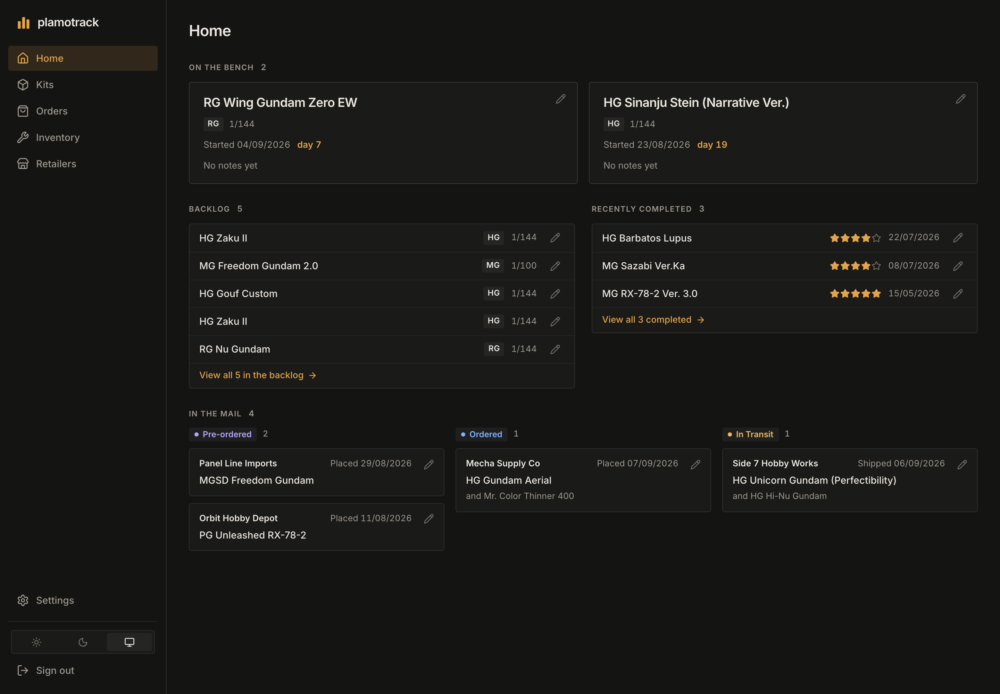
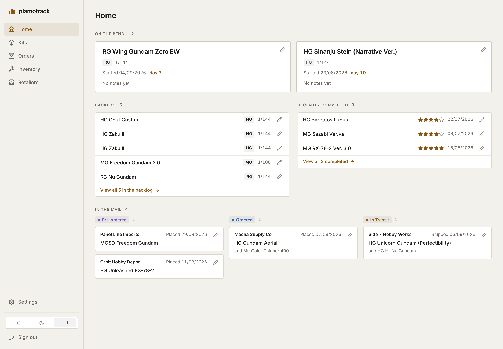
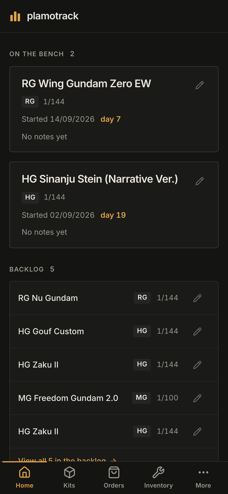
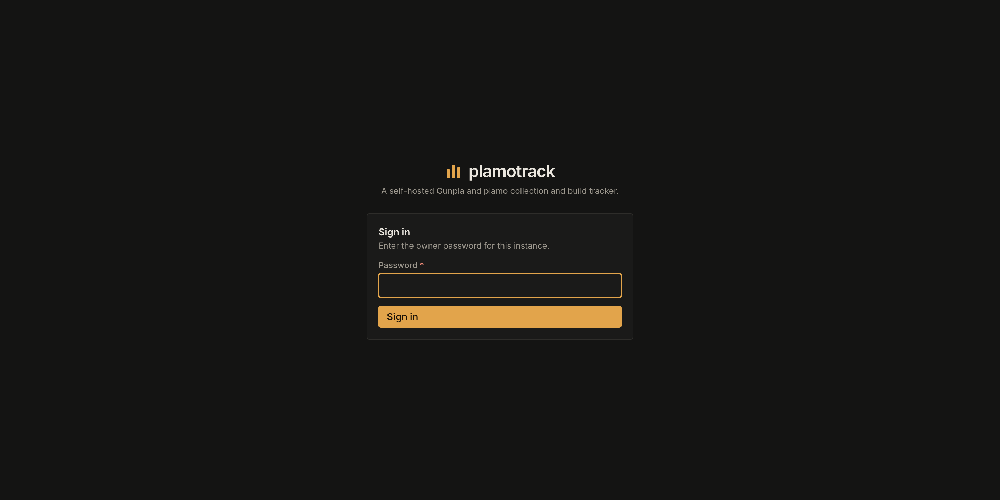

# plamotrack

**Track every kit, tool, and terrible financial decision from pre-order to panel-lined masterpiece.**

A self-hosted Gunpla/plamo collection and build tracker. Kits move through a pipeline
from *pre-ordered* to *complete*, with a Home page that shows the bench, the backlog and
what's in the mail at a glance; orders know which kits they turned into; nippers, cement
and decal sheets get counted; and an embedded MCP server means you can just tell Claude
"the Sinanju arrived" instead of clicking things.

Your data lives in your Postgres, on your hardware, and leaves as plain CSV whenever you
want it to.

**The documentation lives at [docs.gunp.la](https://docs.gunp.la)** — installing, first
run, everyday use, the deployment paths, authentication and the AI/MCP guides, with
screenshots. This README is the short version.

> ### ⚠️ This is a public alpha
>
> **There is a single owner login, personal access tokens, and a tested HTTPS path.** A
> fresh install comes up unclaimed and prints a one-time setup token to the API log; you
> claim it in the browser, every REST route then needs that session, and scripts and
> **MCP clients** authenticate with an access token minted under Settings. The owner
> login can be a password or a sign-in at your own OpenID Connect provider
> (`AUTH_MODE=oidc`). The door stays on localhost by default; the four ways to open it —
> a private network, your own reverse proxy, a Cloudflare Tunnel, or a VPS behind Caddy —
> are in the [deployment guides](https://docs.gunp.la/deployment/overview), each with
> what was actually tested for it. Read that before you widen anything.
>
> The database schema is also still moving. Migrations are provided and tested in both
> directions, but export an archive before you upgrade. It takes one click, and that's
> exactly why it exists.

---



## What it actually does

### A start page that admits you have a backlog

Six statuses — pre-ordered, ordered, in transit, backlog, building, complete — and a
Home page that reads them the way a Sunday afternoon does. **On the bench** is what
you're building, each kit with its start date, a day counter and your latest note.
**Backlog** and **Recently completed** show the six most recent of each with the true
count beside the heading, and a *view all* link into the full list, already filtered.
**In the mail** is the money still in flight — pre-ordered, ordered, in transit — as
order cards with the retailer, the carrier and the tracking number once it ships.

Every card carries an edit control that opens the same dialog the list pages use, so a
status change travels with the dates it should. There is no drag-and-drop: the board it
replaced was drawn for a dozen kits and stopped being useful somewhere around fifty.

"Backlog" means *in hand, not started*. There is no polite word for this pile. We tried.

### One look, two themes

The interface is one house look — warm near-black surfaces, one amber accent, hairline
borders, Inter, stroke icons — with a light variant of the same tokens. Light, dark or
follow-the-device is a per-browser choice in the sidebar, applied before the first
paint so a dark browser never flashes white. Everything else is an instance-wide
setting; this is the one thing that belongs to the device asking.



### The same thing in your pocket

The hobby shop is where you most need to know whether you already own a Gouf Custom,
and the hobby shop is not where your desk is. Below 768 px the sidebar becomes a tab
bar under your thumb — Home, Kits, Orders, Inventory, More — the tables become cards,
every form opens as a full-screen sheet with its buttons at the foot of the screen,
and Kits and Orders fold their filters and sort order into one *Filter and sort*
sheet. A tablet, or a narrow window, gets an icon rail and tables that fold their
columns to the width they have instead of scrolling sideways. From 1280 px it is the
desktop it always was.



Add it to your home screen — Safari's share menu, or *Install* in Chrome's menu on
Android — and it opens in its own window with its own icon, still signed in. It is
still a web page talking to your server: there is no offline mode, and your collection
is never stored on the phone — only your sign-in and your choice of theme are. What a
phone deliberately leaves out is importing and the blank templates: Data management
offers the exports there and says where the rest lives, because *Replace everything*
does not belong a thumb's width from a mis-tap.

### Orders that know what they turned into

Order a Zaku ×2 and plamotrack creates **two kit rows**, because you own two physical
plastic objects, not "a quantity of 2". Each one remembers which order line it came
from, so fixing a typo in the order fixes it everywhere, and deleting an order cleanly
undoes the whole thing.

Orders are *pending* until you mark them received. That matters more than it sounds:
stock only lands in your inventory when the box does. No more being told you have five
Gundam markers while they're demonstrably still in Osaka.

They know when they shipped, too. Mark an order shipped and its kits ride along in
In Transit with the days counting; mark it received and everything arrives at once.
Both dates backdate — you log the box when you find the time, not when it lands —
and completed builds carry start/finish dates, a rating, and a series you name
yourself, so "everything Iron-Blooded Orphans" is a filter, not an archaeology dig.


If you look closely at the inventory below, Mr. Color Thinner sits at **0 on hand** —
it's on that pending Mecha Supply Co order. It'll count itself the moment you hit
Receive.

### Tools, consumables, upgrades and display gear, counted

Four quantity-tracked catalogs. Consumables can also carry an optional low-stock
threshold, so you find out you're nearly out of Extra Thin *before* the hobby shop
closes. Upgrade parts can be applied to a specific kit, which decrements stock and
records what went where.

**Display gear** — action bases, system stands, diorama scenery, backdrop panels — is
counted and categorised but deliberately *not* linked to particular kits. A stand under
one model this month is under another the next, so recording where each one currently
lives would be wrong more often than right; how many you own is the part worth knowing.
Each carries a category and an optional scale, so "1/144 bases" is a question with an
answer. It's also the least Gunpla-specific thing here: a model-railway or 1/35 armour
collection fills that table with exactly the same shape of thing.

Adding items to an order uses a search-and-pick typeahead, never a free text box. This
is deliberate: give a naming-things-at-11pm hobbyist a text field and within a month
you'll own "GM02 Gundam Marker", "Gundam Marker GM02", and three units of stock split
between them.


### A report card for every retailer

Rating, packing quality, shipping speed, and a blunt would-you-order-again field.
Because six months later you *will not remember* which one sent a $200 Perfect Grade
loose in a bag.


*Everything in these screenshots is invented demo data, ratings included. Mecha Supply
Co isn't a real shop, and the ones that are haven't been graded by anyone — go form your
own opinions, that's what the field is for.*

### Your data, genuinely yours

Export the entire collection as a zip of plain CSVs with a manifest, or pull any single
table as a spreadsheet. Import it back to restore, merge, or move instances — with a
**full preview of every change before anything is written**, and no duplicating what's
already there.

Coming from a spreadsheet, Notion, or Baserow? Grab the starter sheet: one row per kit,
and plamotrack works out the retailers, orders, and order lines for you.

Full details in [docs/import-export.md](docs/import-export.md).


### An MCP server, so you can stop clicking

The API ships with a [Model Context Protocol](https://modelcontextprotocol.io) server
built in — same process, same business logic, no separate thing to run. Point Claude at
it and the conversation goes roughly:

> **You:** grab that Gundam Express order confirmation from my email and add it
> **Claude:** *(reads the email, calls `create_order`)* Added — 2 kits and a pack of
> sanding sponges, A$104.90, pending.
>
> **You:** the Sinanju arrived
> **Claude:** *(calls `list_orders`, then `mark_order_received`)* Marked received. The
> Sinanju Stein is now in your backlog and the markers are on hand.

There is no email-parsing feature in plamotrack and there never will be. Your agent
already has a mail connector; it just needed somewhere to write.

[Setup instructions below.](#wiring-up-the-mcp-server)

---

## What isn't built yet

Being honest up front beats you finding out at 11pm:

| | Status |
|---|---|
| Kits, orders, inventory, retailers, the Home page | ✅ Built |
| CSV import / export | ✅ Built |
| MCP server | ✅ Built |
| Bundled `docker compose up` for the whole local stack | ✅ Built |
| **Internationalisation foundations** | ✅ Milestone 5.1: instance-wide language, formatting locale, time zone, date/hour style, and reference currency; the `en-AU` source catalogue and fallback; a reviewed [translation workflow](docs/translating.md); locale-aware dates, times, numbers, counts, money, and file sizes; structured REST/import diagnostics with translated known identifiers and an English compatibility fallback; and RTL-aware layout utilities. No non-English catalogue ships yet. Upgrades default existing instances to `en-AU`/UTC; naive CSV timestamps are read prospectively in the configured instance zone, stored history is never reinterpreted, and downgrading past the settings migration loses its settings row. |
| **Authentication, OAuth-compatible remote MCP, a tested TLS deployment** | ✅ Milestone 6 — owner login (password or OpenID Connect), personal access tokens, MCP OAuth for Claude web / ChatGPT web / MCP Inspector, and the reference Caddy deployment plus the other tested ways to expose an instance ([docs.gunp.la/deployment](https://docs.gunp.la/deployment/overview)) |
| **MCP `2026-07-28` compatibility** | ✅ Milestone 6.1 — both protocol generations from the one `/mcp/` endpoint, negotiated per request; Claude.ai, ChatGPT, Gemini Spark, Mistral, MCP Inspector, Claude Code and the `mcp-remote` bridge verified against a v0.4.1 candidate, linked before the upgrade and still linked after it and after a restore |
| **UI redesign** | ✅ Milestone 6.5 — one house look on semantic tokens with a per-browser light/dark/system switch, Home in place of the board, filter/sort/page in the list pages' URLs, one edit dialog per record (`docs/design.md` §13) |
| **Phone and tablet layout** | ✅ Milestone 6.6 (v0.5.0-alpha) — three layouts by the width of the window: a bottom tab bar on a phone, an icon rail on a tablet or in a narrow window, the desktop unchanged from 1280 px (one exception: up to 1361 px the Orders table now tucks the order number under the retailer's name, where an ordinary row used to push the edit control off the table's edge). Touch-sized controls; Add to Home Screen (an icon and a standalone window; no offline mode); card rows on a phone with one *Filter and sort* sheet, and on a tablet tables that fold their columns to the width they have instead of scrolling sideways; every dialog a full-screen sheet on a phone, with its actions in a bar at the foot of the screen; Settings as a list of its sections there, and Data management offering the exports only — importing needs a screen from 768 px wide. Every page holds up under a browser font size of up to two and a half times the default on a 320 px phone (`docs/design.md` §13.7; [using it on a phone](https://docs.gunp.la/using/phone-and-tablet)) |
| **Easy hosted deployment and public sandbox** | Planned — [Milestone 6.7](https://github.com/DeusMaximus/plamotrack/milestone/18): published images, one recommended hosting-platform template, a guided VPS path, simpler setup and tested recovery, plus a shared sandbox where visitors can edit invented data that resets daily. Hosting-provider selection and Pocket ID compatibility are not settled; these deployment options and the sandbox are not available yet. |
| **Photo gallery per kit** | 🔨 Milestone 7 |
| **Public read-only showcase page** | 🔨 Milestone 8 — after the admin and MCP paths are protected |

---

## Installing it

> The step-by-step version, with what to expect on screen, is
> [docs.gunp.la/installation](https://docs.gunp.la/installation) and
> [docs.gunp.la/first-run](https://docs.gunp.la/first-run).

You need [Docker](https://docs.docker.com/get-started/get-docker/) with Compose, and
nothing else: no Git, no build, no registry login. Each
[release](https://github.com/DeusMaximus/plamotrack/releases) carries the files to run
it, with the tested images pinned by digest for both `linux/amd64` and `linux/arm64`.

```bash
mkdir plamotrack && cd plamotrack
for f in docker-compose.yml env.example plamotrack-gunpla.zip release.json SHA256SUMS; do curl -fsSLO "https://github.com/DeusMaximus/plamotrack/releases/download/v0.5.2-alpha/$f"; done
sha256sum -c SHA256SUMS          # on macOS: shasum -a 256 -c SHA256SUMS
cp env.example .env
# open .env, replace change-me with a real password
docker compose up -d --no-build --wait
```

That's v0.5.2-alpha, the newest release when this was written; the
[releases page](https://github.com/DeusMaximus/plamotrack/releases) has anything newer.
There is no `latest` tag: updating means choosing the next version on purpose, in the
same folder ([Updating](https://docs.gunp.la/configuration/upgrading)). Keep the folder
and its name: Compose uses the folder's name to name the volume that holds your database.

Open **http://localhost:8080**. The first visit asks for the setup token from the API
log and a password (the alpha note above); every visit after it is this sign-in, and
behind it an empty collection — head to **Settings → Data management → Starter sheet**
to pour an existing spreadsheet in, or just add an order.



The first start downloads the images and takes a minute or two; after that it's
seconds. `.env` is the whole configuration: Compose reads it to start the database
and the API reads it to connect, so there's nothing to keep in sync.

### What you just started

Four containers, but only one open port:

| | |
|---|---|
| **http://localhost:8080** | the app |
| `http://localhost:8080/api/…` | REST API — e.g. `/api/kits`, or `/api/docs` for the interactive docs |
| `http://localhost:8080/mcp/` | MCP endpoint |

The API and database aren't published — they talk over Compose's internal network,
so an instance has exactly one door, and it's bound to `127.0.0.1`. A `migrate`
container runs the database migrations and exits before the API starts; seeing it
as `Exited (0)` is success, not a failure.

Running it on a server and want to reach it from your laptop, or from anywhere? That
door stays on loopback by default for a reason. See the
[deployment guides](https://docs.gunp.la/deployment/overview) — a private network, your
own reverse proxy, a Cloudflare Tunnel, or a VPS behind Caddy, each with what was tested
for it — rather than just widening the bind.

Backups and restores, updating, the security audit log and the full configuration
reference are on the docs site too:
[Backups](https://docs.gunp.la/configuration/backups) ·
[Updating & changelog](https://docs.gunp.la/configuration/upgrading) ·
[Audit log](https://docs.gunp.la/configuration/audit-log) ·
[Configuration](https://docs.gunp.la/configuration/env-reference).

### Something went wrong

- **`POSTGRES_PASSWORD` error from compose** — you skipped `cp env.example .env`.
- **Port 8080 already in use** — set `WEB_PORT` in `.env` to something free.
- **`up --wait` failed** — `docker compose ps` shows which service is unhealthy.
  If it's `migrate`, `docker compose logs migrate` has the reason, and the API
  deliberately won't have started.
- **Password authentication failed** — you changed `POSTGRES_PASSWORD` after the
  database volume was already created. Postgres only reads it when initialising an empty
  data directory. Either set it back, or `docker compose down -v` to start clean, which
  **deletes the database**.
- **Pointing at a Postgres you already run** — uncomment `DATABASE_URL` in `.env`.
- **`421 Misdirected Request`** — you reached the instance by a name it doesn't
  know (a LAN hostname, a container name). Add it to `ALLOWED_HOSTS` in `.env` and
  `docker compose up -d`. Nothing is lost while it's wrong; see
  [Got a 421 error?](https://docs.gunp.la/deployment/local-and-lan#got-a-421-error).
- **Anything else** — the
  [troubleshooting guide](https://docs.gunp.la/configuration/troubleshooting).

---

## Wiring up the MCP server

> Per-client guides — Claude Desktop, Claude Code, and Claude.ai, ChatGPT, Gemini and
> Mistral on the web — are under [docs.gunp.la/mcp/overview](https://docs.gunp.la/mcp/overview).

plamotrack speaks MCP over streamable HTTP at `<your instance>/mcp/`:

```
http://localhost:8080/mcp/          # on the machine that runs it
https://plamotrack.example/mcp/     # behind TLS — docs.gunp.la/deployment/overview
```

The examples below use the loopback form; substitute yours. **Keep the trailing slash.** The bundled stack serves both spellings, but the API
run straight from source (see *Developing on it*) answers a bare `/mcp` with 404 —
it no longer redirects, because a redirect built from the request's own `Host` is
the kind of thing the ingress hardening removed.

Reaching the instance by anything other than `localhost` — a LAN hostname, a
container name — needs that name in `ALLOWED_HOSTS` in `.env`, or the server
answers `421 Misdirected Request`
([Got a 421 error?](https://docs.gunp.la/deployment/local-and-lan#got-a-421-error)).

### First, mint a token

The MCP endpoint takes a **personal access token** and nothing else — your browser
session never authenticates it, so a page in your browser can't drive an agent's tools.
In the app, open **Settings → Access tokens** and create one. *Read-only* is enough for
an agent that looks things up; *read and write* lets it record orders, move kits along
the pipeline and adjust stock. Neither level can change settings, import or export, or
manage tokens — those stay with the owner login. The token is shown **once**; copy it
into the client configuration below, and revoke it from the same page if it ever leaks.
The list shows when each token was last used.

Every client sends it the same way: an `Authorization: Bearer <token>` header, on the
REST API and on `/mcp/` alike. Never put one in a URL — it is ignored as a credential,
and request URIs end up in access logs.

### Claude Desktop

Claude Desktop's **Add custom connector** dialog only accepts publicly reachable
`https://` URLs. An instance behind TLS with a public name in OIDC mode is one — paste
`https://your-instance/mcp/` there and sign in when asked, no token needed (see
*Signing in instead of pasting a token* below). An instance on your own machine or your
own network isn't, so edit the config file directly and bridge the HTTP endpoint into a
stdio server with
[`mcp-remote`](https://www.npmjs.com/package/mcp-remote), which passes the header
through. Open `claude_desktop_config.json` — on macOS at
`~/Library/Application Support/Claude/claude_desktop_config.json`, on Windows at
`%APPDATA%\Claude\claude_desktop_config.json` — and add, with your token in place of
`ptk_…`:

```json
{
  "mcpServers": {
    "plamotrack": {
      "command": "npx",
      "args": [
        "-y",
        "mcp-remote",
        "http://localhost:8080/mcp/",
        "--header",
        "Authorization:${PLAMOTRACK_AUTH}"
      ],
      "env": {
        "PLAMOTRACK_AUTH": "Bearer ptk_…"
      }
    }
  }
}
```

The header goes through an environment variable because Claude Desktop splits `args`
on spaces on some platforms, and `Bearer ptk_…` contains one. Restart Claude Desktop.
If the URL is plain `http://` and it complains about that, add `"--allow-http"` to the
end of the `args` array; an `https://` instance needs no flag.

### Claude Code

```bash
claude mcp add --transport http plamotrack http://localhost:8080/mcp/ \
  --header "Authorization: Bearer ptk_…"
```

### Anything else

It's a standard streamable-HTTP MCP server, so any client that can point at a URL and
send a bearer header will work — give it `<your instance>/mcp/` and
`Authorization: Bearer ptk_…`. Clients that only speak stdio, or that (like Claude
Desktop) only accept publicly reachable URLs, can use the `mcp-remote` bridge shown
above. Instructions for other specific clients are welcome as PRs; open an issue if
yours needs something unusual.

### Signing in instead of pasting a token (OIDC mode)

An instance that signs its owner in through an OpenID Connect provider
(`AUTH_MODE=oidc`) is also an OAuth server for MCP clients: **Claude web, ChatGPT
web and MCP Inspector** take the URL `https://your-instance/mcp/` in their connector
dialog, show a consent page, send you to the same provider, and get tokens of their
own — no paste. Only the owner's account is accepted, and every such token acts as
the owner with read and write access to the collection, never the instance
settings. It needs TLS in front of the instance (the
[deployment guides](https://docs.gunp.la/deployment/overview) — Caddy on the same host
is the tested reference; a Cloudflare Tunnel works too) or a loopback address while
developing, and one more `.env` line; [OIDC login](https://docs.gunp.la/authentication/oidc)
and [Web clients (OAuth)](https://docs.gunp.la/mcp/claude-web-chatgpt) have the setup.
Personal access tokens keep working in that mode too.

### The tools it exposes

| Tool | What it does |
|---|---|
| `get_meta` | App version and the instance's reference currency — what an omitted `currency_code` means |
| `get_summary` | The collection at a glance — kits per status, orders per stage (pre-ordered, ordered, in transit, received); the numbers Home shows |
| `list_kits` | Filter by status, grade or series; `sort=recent` for the kits that last moved, `limit` for the first N |
| `list_kit_series` | Series names already in use — check before writing a new spelling |
| `get_kit` | One kit, in full |
| `create_kit` | Add a kit that *wasn't* bought — a gift, a trade, a carry-over from before tracking; purchases go through `create_order` |
| `update_kit_status` | Move a kit along the pipeline |
| `update_kit` | Edit a kit's details — name, grade, series, rating, notes, build dates |
| `search_catalog` | Search every catalog — the same search the UI typeahead uses, so agents hit the same de-duplication a human does |
| `list_catalog_items` | One whole catalog table, optionally filtered by category — the listing `search_catalog` isn't |
| `list_catalog_categories` | Category names already in use on a table — check before writing a new spelling |
| `create_catalog_tool` / `_consumable` / `_upgrade` / `_display` | Add a catalog row without a purchase — a first stocktake, a gift, a hand-me-down |
| `update_catalog_tool` / `_consumable` / `_upgrade` / `_display` | Edit a catalog row — one tool per catalog, each taking that table's own fields |
| `list_retailers` | Every shop on record, report card included |
| `create_retailer` / `update_retailer` | Add a shop; rate it, note the crushed box, fill in the report card |
| `create_order` | Full order with lines; kits fan out; the shop by its id from `list_retailers`, or by name — matched, or created if new |
| `list_orders` | Optionally pending-only — how an agent finds the order a shipping email belongs to; `sort=recent` by the last status change, `limit` for the first N |
| `get_order` | One order in full — the read an edit starts from |
| `update_order` | Correct an order: header fields and/or the line set; refuses to silently drop lines you didn't restate |
| `mark_order_received` | Applies stock, advances that order's kits to backlog — with an optional arrival date, for deliveries logged after the fact |
| `mark_order_shipped` | Moves that order's waiting kits to in-transit — with an optional ship date, for shipping notifications logged after the fact; never touches stock |
| `adjust_stock` | Nudge a quantity, with a reason |
| `apply_upgrade` | Record an upgrade part going onto a kit |
| `withdraw_upgrade_application` | Undo an application — you say whether the part goes back into stock |

Import and export deliberately have **no** MCP tools. An agent that can silently replace
your entire collection is not a feature.

> ⚠️ The MCP endpoint takes a personal access token (see *First, mint a token*
> above) — or, in OIDC mode, a token the client obtained by signing in as the owner —
> never the browser session, and a personal token's reach is fixed when it is minted.
> Which network the endpoint is on is your call: the
> [deployment guides](https://docs.gunp.la/deployment/overview) say what each way was
> tested for.

### Teach your agent your hobby's conventions

The tools above are generic on purpose — nothing in plamotrack knows what a grade
bucket or a P-Bandai suffix is. That knowledge ships separately as **agent skills**:
packaged convention files your agent loads alongside the MCP connection, so records
come out consistent instead of spelled three ways. The first one covers Gunpla —
kit naming, Bandai kit numbers, Gundam Markers, decals, the lot. It is
`plamotrack-gunpla.zip`, already in the folder you installed from; see
[`skills/`](skills/) for how to install it and what else is available.

---

## Developing on it

Running the containers is the install path; for development you want hot reload, so
run the database in Docker and the app from source.

**You'll need:** Docker · [uv](https://docs.astral.sh/uv/getting-started/installation/) ·
Node 20.19+ (or 22+).

```bash
docker compose -f docker-compose.yml -f docker-compose.dev.yml up -d db --wait
# just Postgres, on fixed loopback and POSTGRES_PORT (5432 by default)

cd backend && uv sync && uv run alembic upgrade head
uv run uvicorn app.main:app --no-proxy-headers       # REST on :8000, MCP at :8000/mcp/

cd ../frontend && npm install && npm run dev         # Vite on :5173, proxies /api to :8000
```

Open **http://localhost:5173**. The API serves at the root here rather than under
`/api` — the Vite dev proxy strips the prefix exactly as nginx does in the container,
so the app's own fetch paths are identical either way.

The development overlay and full stack are the same Compose project, so they share
one database container. Starting the full stack without the overlay recreates the
database container without its host port; the named volume and its data survive.
What you get if both APIs are running is the container's on `:8080` and yours from
source on `:8000`. Harmless, but confusing when a change doesn't show up where you
expected. `docker compose stop web api` leaves just the database.

Already have a Postgres on 5432? Set `POSTGRES_PORT` in `.env` — the development
overlay publishes on it and the source-run API connects to it. The bind stays fixed
to `127.0.0.1`; deliberately remote database access requires your own override.

Tests follow the same configured connection by default, but use a sibling
`<database>_test` database that they create if needed and destructively reset. Set
`TEST_DATABASE_URL` in the test process only when tests need a different connection.

```bash
cd backend
uv run pytest                                        # real Postgres, migrations both ways
uv run ruff check --fix . && uv run ruff format .

cd ../frontend
npm run build                                        # type-check + production build
npm run lint
npm run test:e2e                                     # Playwright (npx playwright install chromium);
                                                     #   claims a fresh instance itself — on one you
                                                     #   claimed, set E2E_OWNER_PASSWORD
```

Two documents are worth reading before you change anything structural:

- **[docs/design.md](docs/design.md)** — why the app is shaped this way. It's a record
  of decisions, not a spec; where it disagrees with the code, the code is right.
- **[AGENTS.md](AGENTS.md)** — the rules that actually bind, for both human and AI
  contributors. The important one: all business logic lives in `app/services/`, and REST
  routers and MCP tools are thin wrappers over it, so the two can never drift apart.

## Contributing

Issues and PRs welcome, especially: other MCP clients, non-Gunpla model kit
taxonomies (the schema deliberately hedges — see design notes §9.1), anyone who has
opinions about grade-to-scale defaults, and interface translations —
[docs/translating.md](docs/translating.md) is the how-to.

Please run the lint/build/test commands above before opening a PR. A contribution guide
with more ceremony arrives at Milestone 9.

## License

MIT — see [LICENSE](LICENSE). Build what you like with it.

---

Not affiliated with Bandai, Bandai Spirits, Sunrise, or anyone else who owns the things
you're gluing together. "Plamo" (プラモ) is the Japanese hobbyist shorthand for plastic
models, which is what this tracks, whether or not it happens to be a robot.
