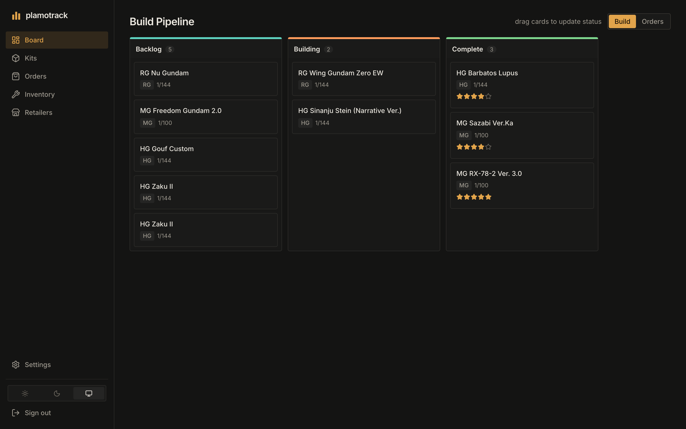
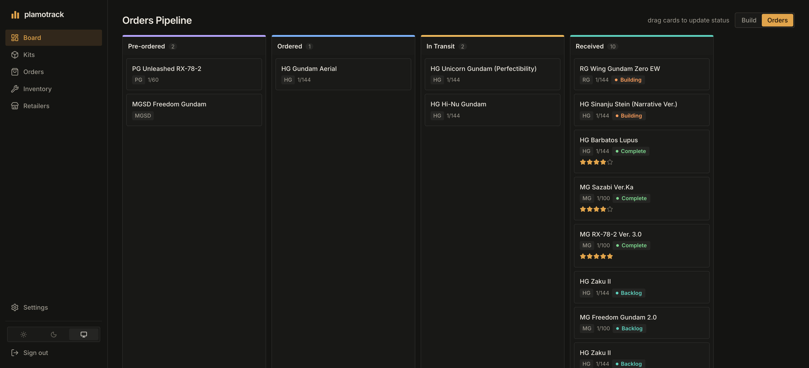
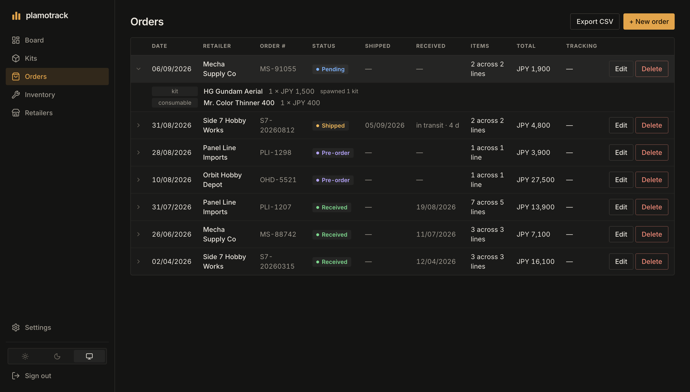
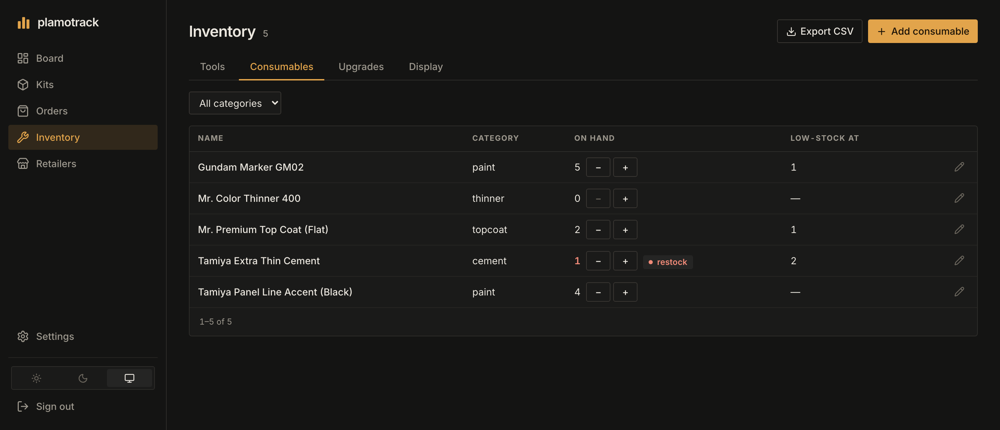
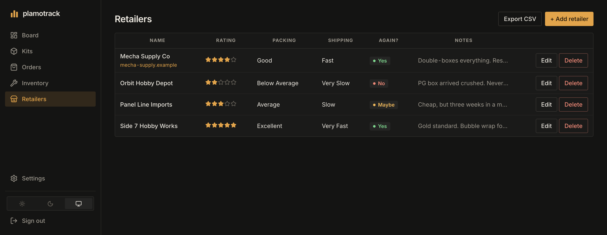
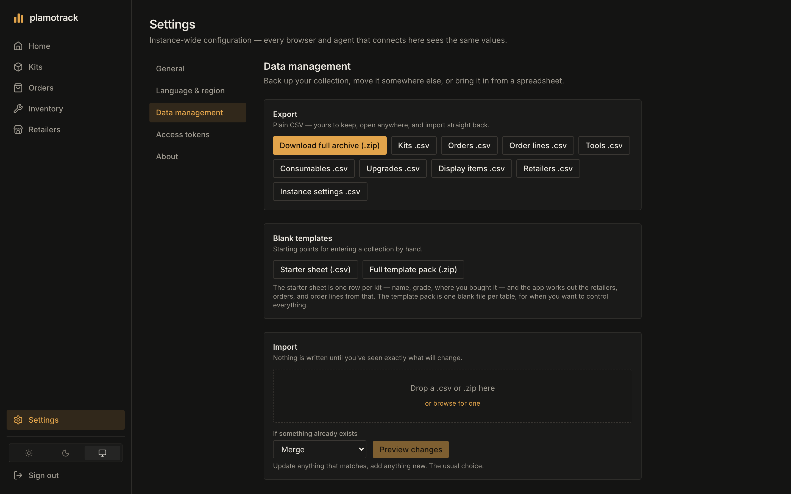

# plamotrack

**Track every kit, tool, and terrible financial decision from pre-order to panel-lined masterpiece.**

A self-hosted Gunpla/plamo collection and build tracker. Kits move across a drag-and-drop
Kanban board from *pre-ordered* to *complete*; orders know which kits they turned into;
nippers, cement and decal sheets get counted; and an embedded MCP server means you can
just tell Claude "the Sinanju arrived" instead of clicking things.

Your data lives in your Postgres, on your hardware, and leaves as plain CSV whenever you
want it to.

> ### ⚠️ This is a public alpha
>
> **There is no authentication yet.** Anyone who can reach the API can write to it, and
> that includes deleting things. Run it on a network you trust — your LAN, a VPN, or
> plain old localhost — and please don't put it on the internet until Milestone 7 lands.
>
> The database schema is also still moving. Migrations are provided and tested in both
> directions, but export an archive before you upgrade. It takes one click, and that's
> exactly why it exists.

---



## What it actually does

### A board that admits you have a backlog

Six statuses — pre-ordered, ordered, in transit, backlog, building, complete — with two
views over them. **Build** shows the three that matter on a Sunday afternoon
(backlog → building → complete). **Orders** shows the money still in flight, with
everything that's arrived collapsed into one Received column so it doesn't fill your
screen with things you already own.

"Backlog" means *in hand, not started*. There is no polite word for this pile. We tried.



### Orders that know what they turned into

Order a Zaku ×2 and plamotrack creates **two kit rows**, because you own two physical
plastic objects, not "a quantity of 2". Each one remembers which order line it came
from, so fixing a typo in the order fixes it everywhere, and deleting an order cleanly
undoes the whole thing.

Orders are *pending* until you mark them received. That matters more than it sounds:
stock only lands in your inventory when the box does. No more being told you have five
Gundam markers while they're demonstrably still in Osaka.



If you look closely at the inventory below, Mr. Color Thinner sits at **0 on hand** —
it's on that pending Mecha Supply Co order. It'll count itself the moment you hit
Receive.

### Tools, consumables, and upgrades, counted

Three quantity-tracked catalogs, with an optional low-stock threshold so you find out
you're nearly out of Extra Thin *before* the hobby shop closes. Upgrade parts can be
applied to a specific kit, which decrements stock and records what went where.

Adding items to an order uses a search-and-pick typeahead, never a free text box. This
is deliberate: give a naming-things-at-11pm hobbyist a text field and within a month
you'll own "GM02 Gundam Marker", "Gundam Marker GM02", and three units of stock split
between them.



### A report card for every retailer

Rating, packing quality, shipping speed, and a blunt would-you-order-again field.
Because six months later you *will not remember* which one sent a $200 Perfect Grade
loose in a bag.



### Your data, genuinely yours

Export the entire collection as a zip of plain CSVs with a manifest, or pull any single
table as a spreadsheet. Import it back to restore, merge, or move instances — with a
**full preview of every change before anything is written**, and no duplicating what's
already there.

Coming from a spreadsheet, Notion, or Baserow? Grab the starter sheet: one row per kit,
and plamotrack works out the retailers, orders, and order lines for you.

Full details in [docs/import-export.md](docs/import-export.md).



### An MCP server, so you can stop clicking

The API ships with a [Model Context Protocol](https://modelcontextprotocol.io) server
built in — same process, same business logic, no separate thing to run. Point Claude at
it and the conversation goes roughly:

> **You:** grab that Gundam Express order confirmation from my email and add it
> **Claude:** *(reads the email, calls `create_order`)* Added — 2 kits and a pack of
> sanding sponges, A$104.90, pending.
>
> **You:** the Sinanju arrived
> **Claude:** *(calls `list_orders`, then `mark_order_received`)* Marked received. The
> Sinanju Stein is now in your backlog and the markers are on hand.

There is no email-parsing feature in plamotrack and there never will be. Your agent
already has a mail connector; it just needed somewhere to write.

[Setup instructions below.](#wiring-up-the-mcp-server)

---

## What isn't built yet

Being honest up front beats you finding out at 11pm:

| | Status |
|---|---|
| Kits, orders, inventory, retailers, Kanban board | ✅ Built |
| CSV import / export | ✅ Built |
| MCP server | ✅ Built |
| **Photo gallery per kit** | 🔨 Milestone 5 |
| **Public read-only showcase page** | 🔨 Milestone 6 |
| **Authentication** | 🔨 Milestone 7 — yes, really, see the warning above |
| **Bundled `docker compose up` for the whole stack** | 🔨 Milestone 8 — today compose only starts Postgres |

---

## Installing it

Right now the database runs in Docker and the app runs from source. One-command
packaging is Milestone 8.

**You'll need:** [Docker](https://docs.docker.com/get-started/get-docker/) ·
[uv](https://docs.astral.sh/uv/getting-started/installation/) ·
Node 20.19+ (or 22+) · about five minutes.

### 1. Clone and set a password

```bash
git clone https://github.com/DeusMaximus/plamotrack.git && cd plamotrack
cp .env.example .env
```

Open `.env` and replace `change-me`. That one file is the whole configuration — Docker
Compose reads it to start the database, and the API reads it to connect, so there's
nothing to keep in sync.

### 2. Start Postgres

```bash
docker compose up -d db --wait
```

This publishes the database on `127.0.0.1` only, so nothing outside this machine can
reach it. If you need remote access, set `POSTGRES_BIND` in `.env` — and set a real
password before you do.

### 3. Start the API (and the MCP server — same process)

```bash
cd backend && uv sync && uv run alembic upgrade head && uv run uvicorn app.main:app
```

That gives you the REST API on `http://localhost:8000`, interactive API docs at
`http://localhost:8000/docs`, and the MCP endpoint at `http://localhost:8000/mcp/`.

### 4. Start the frontend

In a second terminal:

```bash
cd frontend && npm install && npm run dev
```

Open **http://localhost:5173** and you're looking at an empty collection. Head to
**Data → Starter sheet** to pour an existing spreadsheet in, or just add an order.

### Something went wrong

- **`connection refused` from the API** — Postgres isn't up yet. `docker compose ps`
  should show the `db` container healthy.
- **`POSTGRES_PASSWORD` error from compose** — you skipped `cp .env.example .env`.
- **Password authentication failed** — you changed `POSTGRES_PASSWORD` after the
  database volume was already created. Postgres only reads it when initialising an empty
  data directory. Either set it back, or `docker compose down -v` to start clean, which
  deletes the database.
- **Port 5432 already in use** — you have another Postgres. Set `POSTGRES_PORT` in
  `.env` to something free; compose publishes on it and the API connects to it.
- **Frontend loads but every list is empty with an error banner** — the API isn't
  running on port 8000. The Vite dev server proxies `/api` there.
- **Pointing at a Postgres you already run** — uncomment `DATABASE_URL` in `.env` and
  skip step 2 entirely.

---

## Wiring up the MCP server

plamotrack speaks MCP over streamable HTTP at:

```
http://localhost:8000/mcp/
```

**Keep the trailing slash.** Without it you get a 307 redirect, and not every client
follows redirects on POST.

### Claude Desktop

Edit the config file directly — Claude Desktop's **Add custom connector** dialog only
accepts publicly reachable URLs, and a self-hosted plamotrack on your own network isn't
one. Nor should it be at this stage; see the alpha warning above.

So bridge the HTTP endpoint into a stdio server with
[`mcp-remote`](https://www.npmjs.com/package/mcp-remote). Open
`claude_desktop_config.json` — on macOS at
`~/Library/Application Support/Claude/claude_desktop_config.json`, on Windows at
`%APPDATA%\Claude\claude_desktop_config.json` — and add:

```json
{
  "mcpServers": {
    "plamotrack": {
      "command": "npx",
      "args": ["-y", "mcp-remote", "http://localhost:8000/mcp/"]
    }
  }
}
```

Restart Claude Desktop. If it complains about the URL not being HTTPS, add
`"--allow-http"` to the end of the `args` array.

### Claude Code

```bash
claude mcp add --transport http plamotrack http://localhost:8000/mcp/
```

### Anything else

It's a standard streamable-HTTP MCP server, so any client that can point at a local URL
will work — give it `http://localhost:8000/mcp/`. Clients that only speak stdio, or
that (like Claude Desktop) only accept publicly reachable URLs, can use the `mcp-remote`
bridge shown above. Instructions for other specific clients are welcome as PRs; open an
issue if yours needs something unusual.

### The tools it exposes

| Tool | What it does |
|---|---|
| `list_kits` | Filter by status or grade |
| `get_kit` | One kit, in full |
| `update_kit_status` | Move a kit along the pipeline |
| `search_catalog` | Search tools/consumables/upgrades — the same search the UI typeahead uses, so agents hit the same de-duplication a human does |
| `create_order` | Full order with lines; kits fan out, retailers are matched by name or created |
| `list_orders` | Optionally pending-only — how an agent finds the order a shipping email belongs to |
| `mark_order_received` | Applies stock, advances that order's kits to backlog |
| `adjust_stock` | Nudge a quantity, with a reason |
| `apply_upgrade` | Record an upgrade part going onto a kit |

Import and export deliberately have **no** MCP tools. An agent that can silently replace
your entire collection is not a feature.

> ⚠️ The MCP server has no auth either — it's the same unauthenticated process as the
> REST API. Keep it on localhost or a trusted network.

---

## Developing on it

```bash
cd backend
uv run pytest                                        # real Postgres, migrations both ways
uv run ruff check --fix . && uv run ruff format .

cd ../frontend
npm run build                                        # type-check + production build
npm run lint
npm run test:e2e                                     # Playwright (npx playwright install chromium)
```

Two documents are worth reading before you change anything structural:

- **[docs/design.md](docs/design.md)** — why the app is shaped this way. It's a record
  of decisions, not a spec; where it disagrees with the code, the code is right.
- **[AGENTS.md](AGENTS.md)** — the rules that actually bind, for both human and AI
  contributors. The important one: all business logic lives in `app/services/`, and REST
  routers and MCP tools are thin wrappers over it, so the two can never drift apart.

## Contributing

Issues and PRs welcome, especially: other MCP clients, non-Gunpla model kit
taxonomies (the schema deliberately hedges — see design notes §9.1), and anyone who has
opinions about grade-to-scale defaults.

Please run the lint/build/test commands above before opening a PR. A contribution guide
with more ceremony arrives at Milestone 9.

## License

MIT — see [LICENSE](LICENSE). Build what you like with it.

---

Not affiliated with Bandai, Bandai Spirits, Sunrise, or anyone else who owns the things
you're gluing together. "Plamo" (プラモ) is the Japanese hobbyist shorthand for plastic
models, which is what this tracks, whether or not it happens to be a robot.
